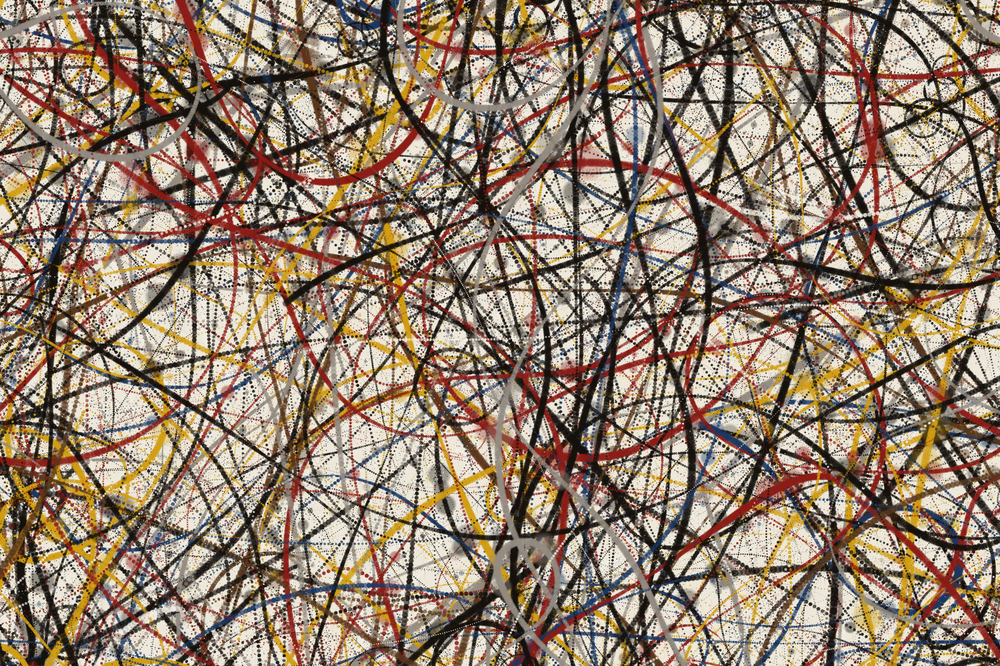

## Overview

Pollock is a command-line tool that generates procedural drip paintings in the
style of Jackson Pollock. Written in C using libpng, it simulates gestural
brushwork through layered paint strokes, splatter, and drips across a
configurable canvas.

Each stroke follows a spring-driven trajectory with sine-wave oscillators for
organic waviness, producing results that vary from tight linear sweeps to loose
arcing curves. Splatters and drips are applied stochastically along each stroke
path. The output is written as a PNG file.

  

## Features

- Procedural paint stroke simulation with spring-driven paths
- Splatter and drip effects applied stochastically per stroke
- Customizable canvas dimensions, stroke count, and color palette
- Built-in palette files for common color schemes
- Support for loading custom palettes from plain-text files
- Per-run random seed for reproducible output
- Aspect ratio and scale helpers for quick canvas sizing
- Progress reporting to stderr during generation
- PNG output via libpng

## Usage

## Dependencies

## License

This work is licensed under the GNU General Public License version 3 (GPLv3).

